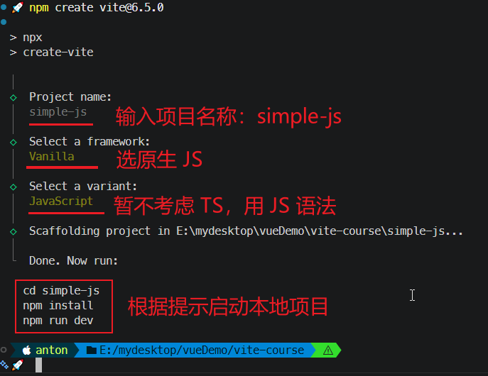
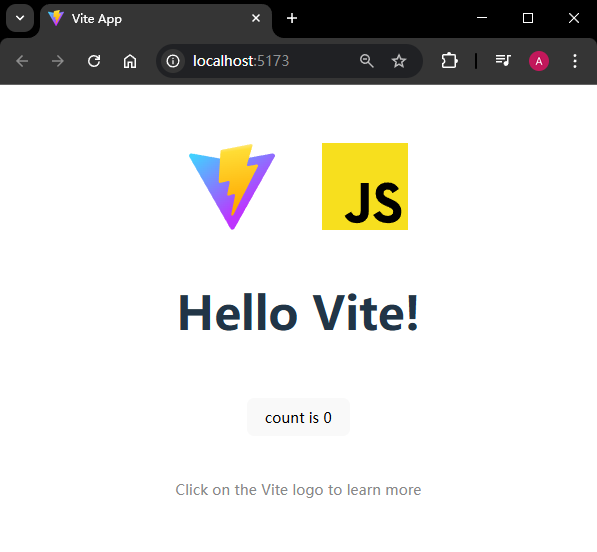
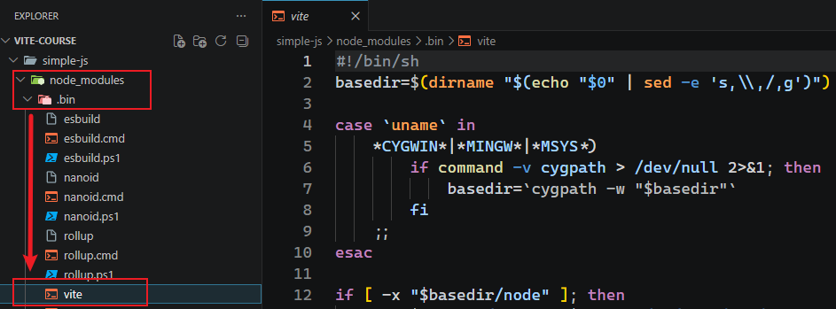
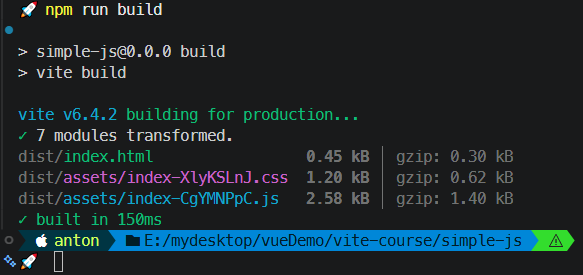
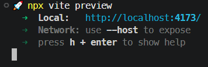
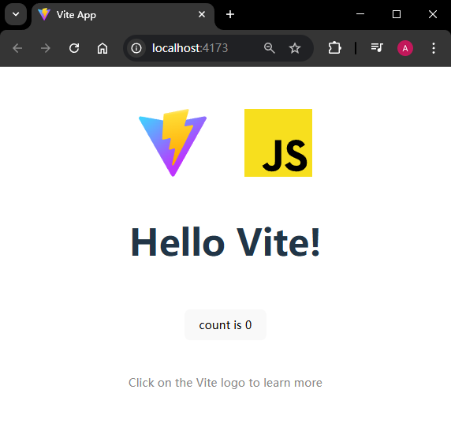
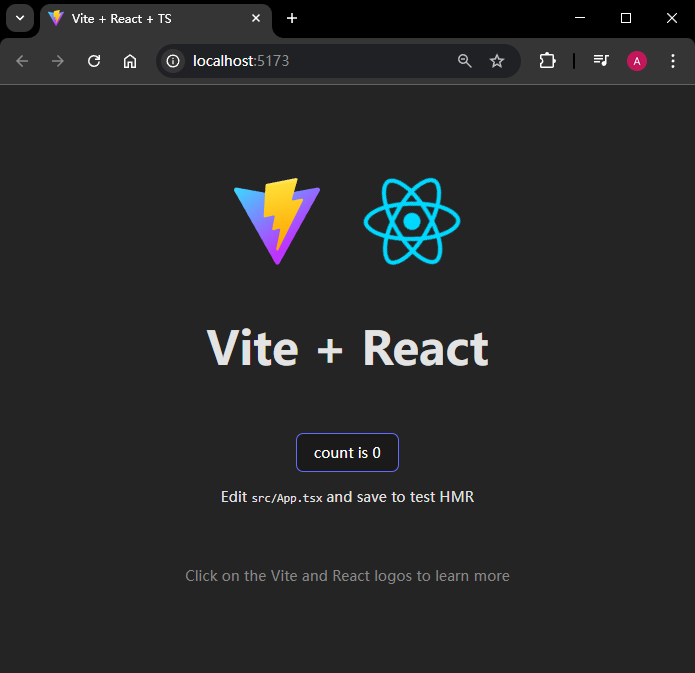

# S2.3(L06)：First contact with Vite

---


准备工作：`NodeJS` 切到 `v22.12.0`。创建文件夹 `vite-course` 并用 `VSCode` 打开该文件夹。


## 1 实战1：用 Vite 创建原生 JS 项目

创建一个名为 `simple-js` 的纯 `JS` 原生项目需要执行的命令如下：

```powershell
npm create vite@6.5.0
# 输入项目名称：simple-js
# 框架选原生 JS
# 实现语法（TS/JS）选 JS

# 按照提示启动 simple-js 项目
cd simple-js
npm i
npm run dev
```

实测截图如下：



运行效果如下：



注意：启动项目的脚本 `npm run dev` 实际执行的是 `vite` 命令（第 `L7` 行）：

```json
{
  "name": "simple-js",
  "private": true,
  "version": "0.0.0",
  "type": "module",
  "scripts": {
    "dev": "vite",
    "build": "vite build",
    "preview": "vite preview"
  },
  "devDependencies": {
    "vite": "^6.3.5"
  }
}
```

该命令位于 `node_modules/.bin/vite`：



该启动命令也可以直接用 `npx vite` 执行。

若要构建该项目，执行命令 `npm run build` 既可：



运行构建出的项目，执行预览命令 `npm run preview` 或 `npx vite preview` 即可（按 `q` 键退出）。此时项目会直接使用 `dist` 目录中的打包产物并部署到本地服务的 `4173` 端口（无需借助 `VSCode Live Server` 插件）：






## 2 实战2：用 Vite 创建 React + TS 项目

执行命令：

```powershell
# （当前位于 vite-course/simple-js/ 文件夹下）
cd ..
mkdir React-app
cd React-app
npm create vite@6.5.0
# 无需重复输入项目名，用 “.” 表示即可
# 框架选 React
# 语法选 TS

npm i
npm run dev
```

实测效果（`Chrome` 主题改为深色模式）：



此时项目配置文件 `package.json` 最大的不同在于多了一个 `vite.config.ts` 的 `Vite` 配置，其中添加了基于 `Vite` 实现的 `React` 插件（`L2`、`L6`）：

```ts
import { defineConfig } from 'vite'
import react from '@vitejs/plugin-react'

// https://vite.dev/config/
export default defineConfig({
  plugins: [react()],
})
```


## 3 预告

为了更好地理解 `Vite` 的工作原理，接下来的内容先介绍：

- `ES` 及 `CommonJS` 模块化标准；
- 模块打包方面的基础知识；
- `TreeShaking` 技术。